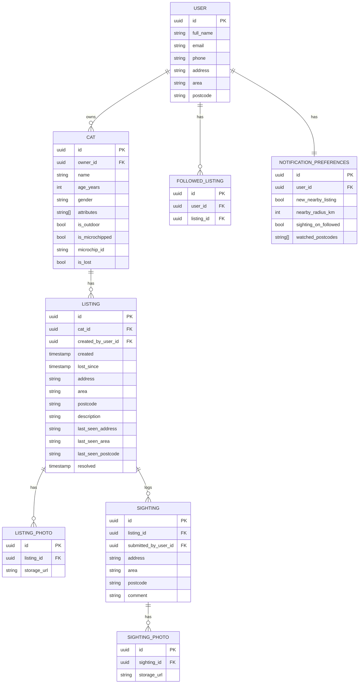

# kisa

```mermaid
erDiagram
    USER ||--o{ CAT : owns
    USER ||--O{ FOLLOWED_LISTING : has
    USER ||--|| NOTIFICATION_PREFERENCES : has
    USER {
        uuid id PK
        string full_name
        string email
        string phone
        string address
        string area
        string postcode
    }
    CAT ||--o{ LISTING : has
    CAT {
        uuid id PK
        uuid owner_id FK
        string name
        int age_years
        string gender
        string[] attributes
        bool is_outdoor
        bool is_microchipped
        string microchip_id
        bool is_lost
    }
    LISTING ||--o{ LISTING_PHOTO : has
    LISTING ||--o{ SIGHTING : logs
    LISTING {
        uuid id PK
        uuid cat_id FK
        uuid created_by_user_id FK
        timestamp created
        timestamp lost_since
        string address
        string area
        string postcode
        string description
        string last_seen_address
        string last_seen_area
        string last_seen_postcode
        timestamp resolved
    }
    LISTING_PHOTO {
        uuid id PK
        uuid listing_id FK
        string storage_url
    }
    FOLLOWED_LISTING {
        uuid id PK
        uuid user_id FK
        uuid listing_id FK
    }
    SIGHTING ||--o{ SIGHTING_PHOTO : has
    SIGHTING {
        uuid id PK
        uuid listing_id FK
        uuid submitted_by_user_id FK
        string address
        string area
        string postcode
        string comment
    }
    SIGHTING_PHOTO {
        uuid id PK
        uuid sighting_id FK
        string storage_url
    }
    NOTIFICATION_PREFERENCES {
        uuid id PK
        uuid user_id FK
        bool new_nearby_listing
        int nearby_radius_km 
        bool sighting_on_followed
        string[] watched_postcodes
    }
```